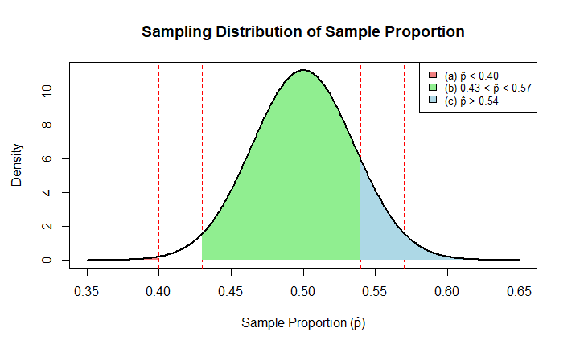

# Formative Assessment 5"

### Authors: 

SINOCRUZ, ARVIE

TAGAYTAY, GABRIEL

Date: October 06, 2025

# Problem 8.18
## Population values (from Problem 8.17)
```{r}
population <- c(9, 12, 15)
```
## Generate all possible samples of size 2 with replacement
```{r}
samples <- expand.grid(A = population, B = population)
```
## Compute the sample mean for each combination
```{r}
samples$mean <- rowMeans(samples)
```

## Calculate probabilities (since population is uniform, each has equal prob = 1/9)
```{r}
samples$p_xbar <- 1 / nrow(samples)
```

## Compute xbar * p(xbar) and xbar^2 * p(xbar)
```{r}
samples$xbar_p <- samples$mean * samples$p_xbar
samples$xbar2_p <- (samples$mean^2) * samples$p_xbar
```

## Display table
```{r}
samples
```

## Compute mean of sampling distribution
```{r}
mu_xbar <- sum(samples$xbar_p)
```

## Compute variance of sampling distribution
```{r}
sigma2_xbar <- sum(samples$xbar2_p) - mu_xbar^2
```

## Compare with population mean and variance
```{r}
mu <- mean(population)
sigma2 <- var(population)
```

## Show results
```{r}
cat("Population mean (mu):", mu, "\n")
cat("Sampling mean (muxbar):", mu_xbar, "\n")
cat("Population variance (sigma^2):", sigma2, "\n")
cat("Sampling variance (sigmaxbar^2):", sigma2_xbar, "\n")
cat("sigmaxbar^2 ≈ sigma^2 / 2:", sigma2 / 2, "\n")
```

## Plot sampling distribution
```{r}
library(ggplot2)
ggplot(samples, aes(x = mean)) +
  geom_histogram(aes(y = ..density..), bins = 5, fill = "skyblue", color = "black") +
  geom_density(alpha = 0.2, fill = "blue") +
  labs(title = "Distribution of x̄ for n = 2",
       x = "x̄ (Sample Mean)",
       y = "Probability Density") +
  theme_minimal()
```

---

# Problem 8.21
## (a). Population mean and variance
```{r}
# Population
population <- c(3, 7, 11, 15)

# Population mean (μ)
mu <- mean(population)

# Population variance (σ²) and standard deviation (σ)
sigma2 <- var(population)  # sample variance, same as population variance formula for this exercise
sigma <- sqrt(sigma2)

cat("Population mean (μ):", mu, "\n")
cat("Population variance (σ²):", sigma2, "\n")
cat("Population standard deviation (σ):", sigma, "\n")
```
## (b). Generate all possible samples of size 2 (with replacement)
```{r}
# All combinations of 3, 7, 11, 15 with replacement
samples <- expand.grid(A = population, B = population)

# Compute sample means
samples$mean <- rowMeans(samples)

# Each sample equally likely → probability = 1 / (number of samples)
samples$p_xbar <- 1 / nrow(samples)

# Compute x̄ * p(x̄) and x̄² * p(x̄)
samples$xbar_p <- samples$mean * samples$p_xbar
samples$xbar2_p <- (samples$mean^2) * samples$p_xbar

# Show table
samples
```
## (c). Mean of the sampling distribution of means (μₓ̄) 
```{r}
mu_xbar <- sum(samples$xbar_p)
cat("Mean of sampling distribution (μₓ̄):", mu_xbar, "\n")
```
## (d). Standard deviation of the sampling distribution of means (σₓ̄) 
```{r}
# Variance of sampling distribution
sigma2_xbar <- sum(samples$xbar2_p) - mu_xbar^2
sigma_xbar <- sqrt(sigma2_xbar)

cat("Variance of sampling distribution (σₓ̄²):", sigma2_xbar, "\n")
cat("Standard deviation of sampling distribution (σₓ̄):", sigma_xbar, "\n")
```
## (e). Verification: σₓ̄ = σ / √n
```{r}
n <- 2
sigma_xbar_formula <- sigma / sqrt(n)

cat("σₓ̄ (computed):", sigma_xbar, "\n")
cat("σ / √n (formula):", sigma_xbar_formula, "\n")
```
## (f). Plot the sampling distribution of the mean
```{r}
library(ggplot2)
ggplot(samples, aes(x = mean)) +
  geom_histogram(aes(y = ..density..), bins = 8, fill = "lightblue", color = "black") +
  geom_density(alpha = 0.2, fill = "blue") +
  labs(title = "Sampling Distribution of x̄ (n = 2)",
       x = "x̄ (Sample Mean)",
       y = "Probability Density") +
  theme_minimal()
```
---
# Problem 8.34
```{r results='asis'}
# Given values
n <- 200
p <- 0.5
q <- 1 - p

# Standard deviation
sd_p <- sqrt(p * q / n)

# Probabilities
prob_a <- pnorm(0.40, mean = p, sd = sd_p)
prob_b <- pnorm(0.57, mean = p, sd = sd_p) - pnorm(0.43, mean = p, sd = sd_p)
prob_c <- 1 - pnorm(0.54, mean = p, sd = sd_p)

cat("$$ \\text{Standard deviation } (\\sigma_{\\hat{p}}) = ", round(sd_p, 4), " $$\n\n")
cat("$$ P(\\hat{p} < 0.40) = ", round(prob_a, 4), " $$\n")
cat("$$ P(0.43 < \\hat{p} < 0.57) = ", round(prob_b, 4), " $$\n")
cat("$$ P(\\hat{p} > 0.54) = ", round(prob_c, 4), " $$\n")

# Plot the sampling distribution
x <- seq(0.35, 0.65, by = 0.001)
y <- dnorm(x, mean = p, sd = sd_p)

plot(x, y, type = "l", lwd = 2, col = "blue",
     main = "Sampling Distribution of Sample Proportion",
     xlab = "Sample Proportion (p̂)",
     ylab = "Density")

# Reference lines
abline(v = c(0.40, 0.43, 0.54, 0.57), col = "red", lty = 2)

# --- (a) Shade p̂ < 0.40 ---
x_a <- seq(0.35, 0.40, by = 0.001)
y_a <- dnorm(x_a, mean = p, sd = sd_p)
polygon(c(x_a, rev(x_a)), c(y_a, rep(0, length(y_a))), col = "lightcoral", border = NA)

# --- (b) Shade 0.43 < p̂ < 0.57 ---
x_b <- seq(0.43, 0.57, by = 0.001)
y_b <- dnorm(x_b, mean = p, sd = sd_p)
polygon(c(x_b, rev(x_b)), c(y_b, rep(0, length(y_b))), col = "lightgreen", border = NA)

# --- (c) Shade p̂ > 0.54 ---
x_c <- seq(0.54, 0.65, by = 0.001)
y_c <- dnorm(x_c, mean = p, sd = sd_p)
polygon(c(x_c, rev(x_c)), c(y_c, rep(0, length(y_c))), col = "lightblue", border = NA)

# Redraw curve
lines(x, y, lwd = 2, col = "black")

# Legend
legend("topright",
       legend = c("(a) p̂ < 0.40", "(b) 0.43 < p̂ < 0.57", "(c) p̂ > 0.54"),
       fill = c("lightcoral", "lightgreen", "lightblue"),
       border = "black", cex = 0.8)
```
$$ \text{Standard deviation } (\sigma_{\hat{p}}) = 0.0354 $$

$$ P(\hat{p} < 0.40) = 0.0082 $$  
$$ P(0.43 < \hat{p} < 0.57) = 0.9802 $$  
$$ P(\hat{p} > 0.54) = 0.1141 $$  



### Interpretation
1. There’s only about a **0.82%** chance that less than 40% will be boys.  
2. There’s a **98%** chance that between 43% and 57% will be girls.  
3. There’s an **11.5%** chance that more than 54% will be boys.  

---

# Problem 8.49
```{r results='asis', message=FALSE}
x <- c(6, 9, 12, 15, 18)
probab <- c(0.1, 0.2, 0.4, 0.2, 0.1)
n <- 2

# --- Population mean and variance ---
mu <- sum(x * probab)
sigma2 <- sum(probab * (x - mu)^2)

cat("$$ \\text{Population mean } (\\mu) = ", mu, " $$\n")
cat("$$ \\text{Population variance } (\\sigma^2) = ", sigma2, " $$\n\n")

samples <- expand.grid(x1 = x, x2 = x, KEEP.OUT.ATTRS = FALSE)
samples$mean <- rowMeans(samples)

# Probability lookup for each element
p_lookup <- setNames(probab, x)
samples$prob <- p_lookup[as.character(samples$x1)] * p_lookup[as.character(samples$x2)]

# --- Table 1: All possible samples ---
cat("**Table 1. All Possible Samples (n = 2)**\n\n")
knitr::kable(samples,
             col.names = c("x1", "x2", "Sample Mean (x̄)", "Probability"),
             caption = "All ordered samples with their probabilities.",
             align = "c")

# --- Sampling distribution of the sample mean ---
dist_mean <- aggregate(prob ~ mean, data = samples, FUN = sum)
dist_mean <- dist_mean[order(dist_mean$mean), ]

# --- Table 2: Sampling distribution ---
cat("\n**Table 2. Sampling Distribution of the Sample Mean**\n\n")
knitr::kable(dist_mean,
             col.names = c("Sample Mean (x̄)", "Probability"),
             caption = "Distribution of sample means and their probabilities.",
             align = "c")

# --- Mean and variance of sampling distribution ---
mu_xbar <- sum(dist_mean$mean * dist_mean$prob)
sigma2_xbar <- sum(dist_mean$prob * (dist_mean$mean - mu_xbar)^2)

# --- Display summary in LaTeX ---
cat("\n\n$$ \\text{Mean of sampling distribution } (\\mu_{\\bar{X}}) = ", mu_xbar, " $$\n")
cat("$$ \\text{Variance of sampling distribution } (\\sigma^2_{\\bar{X}}) = ", sigma2_xbar, " $$\n")
cat("$$ \\frac{\\sigma^2}{n} = ", sigma2 / n, " $$\n")
```
$$ \text{Population mean } (\mu) = 12 $$  
$$ \text{Population variance } (\sigma^2) = 10.8 $$  

**Table 1. All Possible Samples (n = 2)**  

| x1 | x2 | Sample Mean (x̄) | Probability |
|----|----|------------------|--------------|
| 6 | 6 | 6.00 | 0.0100 |
| 9 | 6 | 7.50 | 0.0200 |
| 12 | 6 | 9.00 | 0.0400 |
| 15 | 6 | 10.50 | 0.0200 |
| 18 | 6 | 12.00 | 0.0100 |
| 6 | 9 | 7.50 | 0.0200 |
| 9 | 9 | 9.00 | 0.0400 |
| 12 | 9 | 10.50 | 0.0800 |
| 15 | 9 | 12.00 | 0.0400 |
| 18 | 9 | 13.50 | 0.0200 |
| 6 | 12 | 9.00 | 0.0400 |
| 9 | 12 | 10.50 | 0.0800 |
| 12 | 12 | 12.00 | 0.1600 |
| 15 | 12 | 13.50 | 0.0800 |
| 18 | 12 | 15.00 | 0.0400 |
| 6 | 15 | 10.50 | 0.0200 |
| 9 | 15 | 12.00 | 0.0400 |
| 12 | 15 | 13.50 | 0.0800 |
| 15 | 15 | 15.00 | 0.0400 |
| 18 | 15 | 16.50 | 0.0200 |
| 6 | 18 | 12.00 | 0.0100 |
| 9 | 18 | 13.50 | 0.0200 |
| 12 | 18 | 15.00 | 0.0400 |
| 15 | 18 | 16.50 | 0.0200 |
| 18 | 18 | 18.00 | 0.0100 |

**Table 2. Sampling Distribution of the Sample Mean**  

| Sample Mean (x̄) | Probability |
|------------------|--------------|
| 6.00 | 0.0100 |
| 7.50 | 0.0400 |
| 9.00 | 0.1200 |
| 10.50 | 0.2000 |
| 12.00 | 0.2400 |
| 13.50 | 0.2000 |
| 15.00 | 0.1200 |
| 16.50 | 0.0400 |
| 18.00 | 0.0100 |

$$ \text{Mean of sampling distribution } (\mu_{\bar{X}}) = 12 $$  
$$ \text{Variance of sampling distribution } (\sigma^2_{\bar{X}}) = 5.4 $$  
$$ \frac{\sigma^2}{n} = 5.4 $$  

### Interpretation
The population of student credit hours at Metropolitan Technological College has an average of **12 hours** with moderate variation.  
When we take samples of size 2 (with replacement), the mean of all possible sample means remains **12**, confirming that the sample mean is an **unbiased estimator**.  
However, the spread of these sample means is smaller (**variance = 5.4**) than the original population (**variance = 10.8**), showing that averaging reduces variability and makes sample means more reliable indicators of the true population mean.
