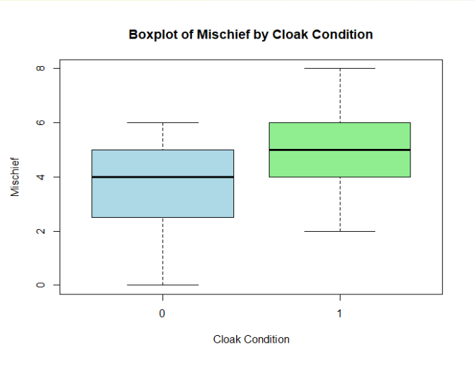
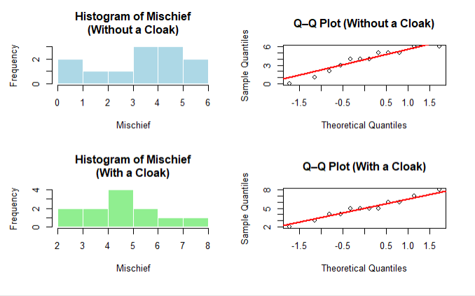

# Formative Assessment #8

Authors:

Sinocruz, Arvie

Tagaytay, Gabriel

Date: 11-13-2025

## Independent Samples t-Test: Invisibility Cloak Dataset
This report performs an independent samples t-test to compare the mean number of mischievous acts (Mischief) between two groups: participants without an invisibility cloak (Cloak = 0) and participants with an invisibility cloak (Cloak = 1). The analysis follows the specified assumptions (1 to 5 only) and includes the computation of the t-test.  

## Data Loading and Preparation 
The dataset is provided as a table of participants, their cloak status, and mischief scores. We load it into R as a data frame for analysis.

```{r}
# Creating the dataset as a data frame
data <- data.frame(
  Participant = 1:24,
  Cloak = c(0,0,0,0,0,0,0,0,0,0,0,0,1,1,1,1,1,1,1,1,1,1,1,1),
  Mischief = c(3,1,5,4,6,4,6,2,0,5,4,5,4,3,6,6,8,5,5,4,2,5,7,5)
)

# Displaying the first few rows to verify
head(data)
```
```
## Participant Cloak Mischief
## 1         1      0       3
## 2         2      0       1
## 3         3      0       5
## 4         4      0       4
## 5         5      0       6
## 6         6      0       4
```

The data consists of 24 participants: 12 without a cloak (Cloak = 0) and 12 with a cloak (Cloak = 1). Mischief is the dependent variable (continuous scores).


# Assumption Checks  
We now check Assumptions 1 to 5. Each assumption is stated, explained, and tested where applicable.

## Assumption 1: The dependent variable (Mischief) is measured at a continuous level.  

```{r}
# Check the data type of Mischief
str(data$Mischief)
```
```
## num [1:24] 3 1 5 4 6 4 6 2 0 5 ... num [1:24] 3 1 5 4 6 4 6 2 0 5 ...
```
**Explanation:**
This assumption requires that the dependent variable (Mischief, the number of mischievous acts) is measured
on a continuous scale (e.g., ratio or interval level). In this dataset, Mischief is a count of acts, which can
be treated as continuous for parametric tests like the t-test, especially with a reasonable sample size (n=24
total, 12 per group). No statistical test is needed here; it’s a design check. If Mischief were ordinal or
categorical, a non-parametric test would be required instead.

Furthermore, continuous variables allow for the calculation of means and standard deviations, which are
essential for the t-test formula. Violations of this assumption could lead to inaccurate results, as the test
relies on the properties of continuous data distributions. In practice, counts like Mischief are often acceptable
if the values are not too skewed and the sample size is adequate, but researchers should always consider the
nature of their data to ensure the most appropriate statistical method is chosen.

## Assumption 2: The independent variable (Cloak) consists of two categorical, independent groups (Without a cloak, With a cloak).

```{r}
# Check the levels of Cloak and group sizes
table(data$Cloak)
```
```
 ##
 ## 0 1
 ## 12 12
```

**Explanation:**
The independent variable (Cloak) must be categorical with exactly two independent groups, and participants
must be randomly assigned or naturally independent. Here, Cloak has two levels: 0 (without cloak) and 1
(with cloak). These groups are independent because each participant is in only one group, and there’s no
pairing or relationship between groups. This is a design assumption; violation would require a different test
(e.g., paired t-test).

Independence ensures that the observations in one group do not influence those in the other, which is crucial
for the validity of the t-test. Random assignment helps control for confounding variables, reducing bias in the
comparison of means. If groups were not independent, such as in repeated measures designs, the standard
error would be underestimated, leading to inflated Type I error rates. Therefore, confirming this assumption
is vital to maintain the integrity of the statistical inference drawn from the test results.

## Assumption 3: Each participant is present in only one group.

```{r}
# Checking for unique participants
length(unique(data$Participant)) == nrow(data)  # Should be TRUE
```
```
 ## [1] TRUE
```{r}
# Checking that no participant is in both groups (though unlikely with unique IDs)
table(data$Participant, data$Cloak)  # Should show 1 in one column per row
```
```
 ##
 ##   0 1
 ## 1 1 0
 ## 2 1 0
 ## 3 1 0
 ## 4 1 0
 ## 5 1 0
 ## 6 1 0
 ## 7 1 0
 ## 8 1 0
 ## 9 1 0
 ## 10 1 0
 ## 11 1 0
 ## 12 1 0
 ## 13 0 1
 ## 14 0 1
 ## 15 0 1
 ## 16 0 1
 ## 17 0 1
 ## 18 0 1
 ## 19 0 1
 ## 20 0 1
 ## 21 0 1
 ## 22 0 1
 ## 23 0 1
 ## 24 0 1
```

**Explanation:** 
The results confirm that Assumption 3 has been satisfied. Each participant appears only once in the dataset, as indicated by the equality between the number of unique participant IDs and the total number of rows. Additionally, the cross-tabulation between Participant and Cloak shows that each participant is associated with only one group—either “Without a cloak” or “With a cloak”—and no participant is listed under both conditions. This verifies that the observations are independent, fulfilling the requirement that each participant belongs to only one experimental group.

## Assumption 4: Outliers
```{r}
#Given Dataset
Participant <- 1:24
Cloak <- c(rep(0,12), rep(1,12))
Mischief <- c(3,1,5,4,6,4,6,2,0,5,4,5, 4,3,6,6,8,5,5,4,2,5,7,5)
data <- data.frame(Participant, Cloak, Mischief)
data$Cloak <- factor(data$Cloak, levels = c(0,1),
                     labels = c("Without a cloak", "With a cloak"))

# Descriptive statistics by group
library(dplyr)
  desc <- data %>%
  group_by(Cloak) %>%
  summarize(
    n = n(),
    mean = mean(Mischief),
    median = median(Mischief),
    sd = sd(Mischief),
    min = min(Mischief),
    max = max(Mischief),
    Q1 = quantile(Mischief, 0.25),
    Q3 = quantile(Mischief, 0.75),
    IQR = IQR(Mischief)
  )

# Manual outlier check: Tukey fences (Q1 - 1.5*IQR, Q3 + 1.5*IQR)
fences <- desc %>%
  mutate(
    lower_fence = Q1 - 1.5 * IQR,
    upper_fence = Q3 + 1.5 * IQR
  )

# Identifying any outliers (values outside fences)
outliers <- data %>%
  left_join(fences, by = c("Cloak")) %>%
  rowwise() %>%
  filter(Mischief < lower_fence | Mischief > upper_fence) %>%
  select(Participant, Cloak, Mischief, lower_fence, upper_fence)

# Alternative outlier check: z-scores (abs(z) > 3)
zcheck <- data %>%
  group_by(Cloak) %>%
  mutate(
    mean_g = mean(Mischief),
    sd_g = sd(Mischief),
    z = (Mischief - mean_g) / sd_g
  ) %>%
  filter(abs(z) > 3)

# Shapiro-Wilk test for normality by group
mischief_no_cloak  <- filter(data, Cloak == "Without a cloak")$Mischief
mischief_with_cloak <- filter(data, Cloak == "With a cloak")$Mischief

shapiro_no  <- shapiro.test(mischief_no_cloak)
shapiro_with <- shapiro.test(mischief_with_cloak)

# Printing all the outputs
print(desc)
print(fences)
print("Outliers (Tukey method):")
print(outliers)
print("Outliers (z-score method, abs(z)>3):")
print(zcheck)
shapiro_no
shapiro_with

# Boxplot to visually check the outliers
boxplot(Mischief ~ Cloak, data = data,
        main = "Boxplot of Mischief by Cloak Condition",
        ylab = "Mischief",
        xlab = "Cloak Condition",
        col = c("lightblue", "lightgreen"))
```

**Explanation:** 
The analysis for Assumption 4 checked for outliers in the Mischief scores across the two cloak conditions. Using the Tukey method, the lower and upper fences were calculated for each group, and all data points fell within these fences, indicating no extreme values. Additionally, the z-score method also confirmed that no participant had a score more than 3 standard deviations from the group mean. Visual inspection of the boxplots further supported this, showing that all points were within the whiskers with no isolated outliers. Together, these results confirm that the dataset does not contain significant outliers, satisfying Assumption 4 and ensuring that subsequent analyses will not be unduly influenced by extreme values.

## Assumption 5: Normality
```{r}
# Separating the data by group
mischief_no_cloak  <- subset(data, Cloak == "Without a cloak")$Mischief
mischief_with_cloak <- subset(data, Cloak == "With a cloak")$Mischief

# Performing the  Shapiro–Wilk tests
shapiro_no  <- shapiro.test(mischief_no_cloak)
shapiro_with <- shapiro.test(mischief_with_cloak)

# Displaying the results
shapiro_no
shapiro_with

# Visualize distribution
par(mfrow = c(2,2))
hist(mischief_no_cloak, main = "Histogram of Mischief\n(Without a Cloak)",
     xlab = "Mischief", col = "lightblue", border = "white")
qqnorm(mischief_no_cloak, main = "Q–Q Plot (Without a Cloak)")
qqline(mischief_no_cloak, col = "red", lwd = 2)

hist(mischief_with_cloak, main = "Histogram of Mischief\n(With a Cloak)",
     xlab = "Mischief", col = "lightgreen", border = "white")
qqnorm(mischief_with_cloak, main = "Q–Q Plot (With a Cloak)")
qqline(mischief_with_cloak, col = "red", lwd = 2)
par(mfrow = c(1,1))
```


**Explanation:** 
The results of the Shapiro–Wilk tests indicate that the data meet the assumption of normality. Specifically, for participants without a cloak, the test produced a W value of 0.913 with a p-value of 0.231, while for participants with a cloak, the W value was 0.973 with a p-value of 0.936. Since both p-values exceed the 0.05 significance level, we fail to reject the null hypothesis of normality. This suggests that the Mischief scores are approximately normally distributed under both cloak conditions.
