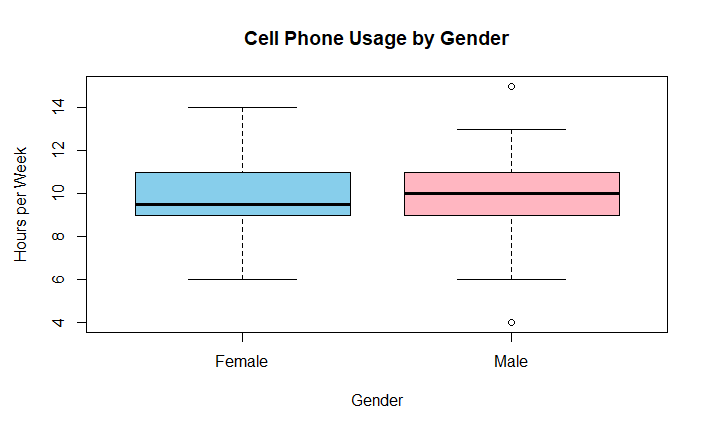
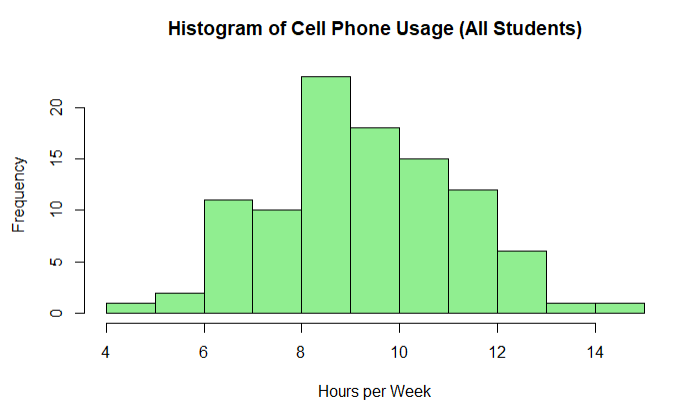

# Summative Assessment 1

Authors: 

SINOCRUZ, ARVIE

TAGAYTAY, GABRIEL

Date: October 11, 2025

## Given Data
```{r}
males <- c(
  12, 4, 11, 13, 11,
  7, 9, 10, 10, 7,
  7, 12, 6, 9, 15,
  10, 11, 12, 7, 8,
  8, 9, 11, 10, 9,
  10, 9, 9, 7, 9,
  11, 7, 10, 10, 11,
  9, 12, 12, 8, 13,
  9, 10, 8, 11, 10,
  13, 13, 9, 10, 13
)

females <- c(
  11, 9, 7, 10, 9,
  10, 10, 7, 9, 10,
  11, 8, 9, 6, 11,
  10, 7, 9, 12, 14,
  11, 12, 12, 8, 12,
  12, 9, 10, 11, 7,
  12, 7, 9, 8, 11,
  10, 8, 13, 8, 10,
  9, 9, 9, 11, 9,
  9, 8, 9, 12, 11
)
```

## Checking sample sizes
```{r}
cat("Number of Male Participants:", length(males), "\n")
cat("Number of Female Participants:", length(females), "\n")
```

## Combining the Data Frame
```{r}
gender <- c(rep("Male", length(males)), rep("Female", length(females)))
hours <- c(males, females)
data <- data.frame(Gender = gender, Hours = hours)
```

## Descriptive statistics for the entire dataset
```{r}
overall_summary <- data.frame(
  Statistic = c("Count", "Mean", "Median", "Standard Dev.", 
                "Variance", "Minimum", "Maximum", "1st Quartile (Q1)", 
                "3rd Quartile (Q3)"),
  Value = c(
    length(data$Hours),
    round(mean(data$Hours), 2),
    round(median(data$Hours), 2),
    round(sd(data$Hours), 2),
    round(var(data$Hours), 2),
    min(data$Hours),
    max(data$Hours),
    round(quantile(data$Hours, 0.25), 2),
    round(quantile(data$Hours, 0.75), 2)
  )
)

cat("**Summary Statistics for the Entire Dataset**\n\n")
print(format(overall_summary, justify = "centre"), row.names = FALSE)
cat("\nNote: This table summarizes the overall descriptive statistics for 
    weekly cell phone usage among all respondents.\n")
```

## Descriptive statistics by gender
```{r}
split_data <- split(data$Hours, data$Gender)

gender_summary <- data.frame(
  Gender = names(split_data),
  Count = sapply(split_data, length),
  Mean = round(sapply(split_data, mean), 2),
  Median = round(sapply(split_data, median), 2),
  SD = round(sapply(split_data, sd), 2),
  Variance = round(sapply(split_data, var), 2),
  Min = sapply(split_data, min),
  Q1 = sapply(split_data, quantile, 0.25),
  Q3 = sapply(split_data, quantile, 0.75),
  Max = sapply(split_data, max)
)

cat("\n**Descriptive Statistics by Gender**\n\n")
print(format(gender_summary, justify = "centre"), row.names = FALSE)
cat("\nThis table presents the key descriptive measures 
    for each gender group.\n")
```

## Visualization
```{r}
boxplot(Hours ~ Gender, data = data,
        main = "Cell Phone Usage by Gender",
        ylab = "Hours per Week", col = c("skyblue", "lightpink"))

hist(data$Hours, breaks = 10, col = "lightgreen",
     main = "Histogram of Cell Phone Usage (All Students)",
     xlab = "Hours per Week")
```






## Report Summary

This analysis compared the average hours spent on cell phone calls per week between male and female students.

**Descriptive Overview**

- Overall Mean Hours: `r round(mean(data$Hours), 2)`
- Male Mean Hours: `r round(mean(males), 2)` | SD: `r round(sd(males), 2)`
- Female Mean Hours: `r round(mean(females), 2)` | SD: `r round(sd(females), 2)`

**Interpretation**

Based on the results, `r if (mean(males) > mean(females)) {"male students spend slightly more hours per week on phone calls compared to females."} else if (mean(females) > mean(males)) {"female students spend slightly more hours per week on phone calls compared to males."} else {"both genders spend approximately the same amount of time on phone calls."}`  

This report provides a descriptive overview of cell phone usage behavior by gender and may serve as a foundation for further statistical testing or behavioral analysis.
